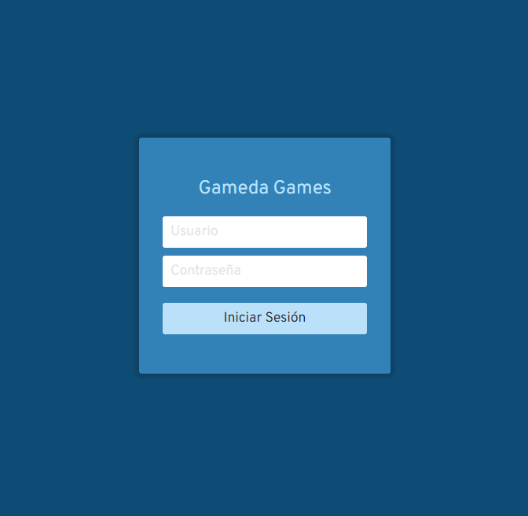
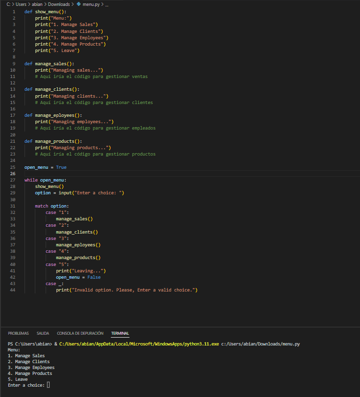

# Anteproyecto - Gameda Games

  
# Indice
  
+ [Identificación](#1)
  + [Descripción del problema](#2)
  + [Objetivos](#3)
  + [Arquitectura y tecnologías a utilizar](#4)
  + [Boceto de la solución](#5)

## Identificación 

**Nombre del proyecto:** Gameda Games

**Autores:** Abián Gustavo Castañeda Méndez y Diego Peraza Cabo

**Curso:** 1º Desarrollo de Aplicaciones Web

## Descripción del problema 

El presente proyecto surge de la necesidad de un empresario de una tienda de videojuegos, debido a la mala gestión que lleva en su empresa, al hacer uso de aplicaciones anticuadas con muchas limitaciones y con interfaces poco intuitivas. Para hacer frente a esto, hemos diseñado un programa que satisface su necesidad, en la que podrá gestionar los productos de su tienda.

## Objetivos 

Esta aplicación esta destinada a la gestión de una tienda de videojuegos, en la cual se lleva a cabo la venta y compra de videojuegos y consolas. Aparte de manejar la información de cada artículo que se vende, también se almacena la información de cada cliente que adquiere un producto y con el fin de controlar todo aquello que se vende y quien lo vende
se dispone de un apartado donde un encargado puede revisar la información de sus empleados.

## Arquitectura y tecnologías a utilizar 

- **Front-end**: Este proyecto pretende hacer uso de HTML y CSS para la realización de una interfaz con la que gestionar todo lo especificado al principio del documento.

- **Back-end**: Este proyecto pretende hacer uso de Python y MySQL para la codificación de las ideas expuestas al comienzo del documento.

## Boceto de la solución 

- Esta imagen contemplaría una idea de como sería el acceso a la aplicación. La idea es crear una interfaz mediante la cual los empleados y encargados tendrán que autenticarse para más tarde gestionar los distintos apartados mencionados anteriormente.

- Esta imagen contemplatría un menú desde el punto de vista del encargado, mediante el cual los trabajadores podrán gestionar clientes, ventas, etc.

