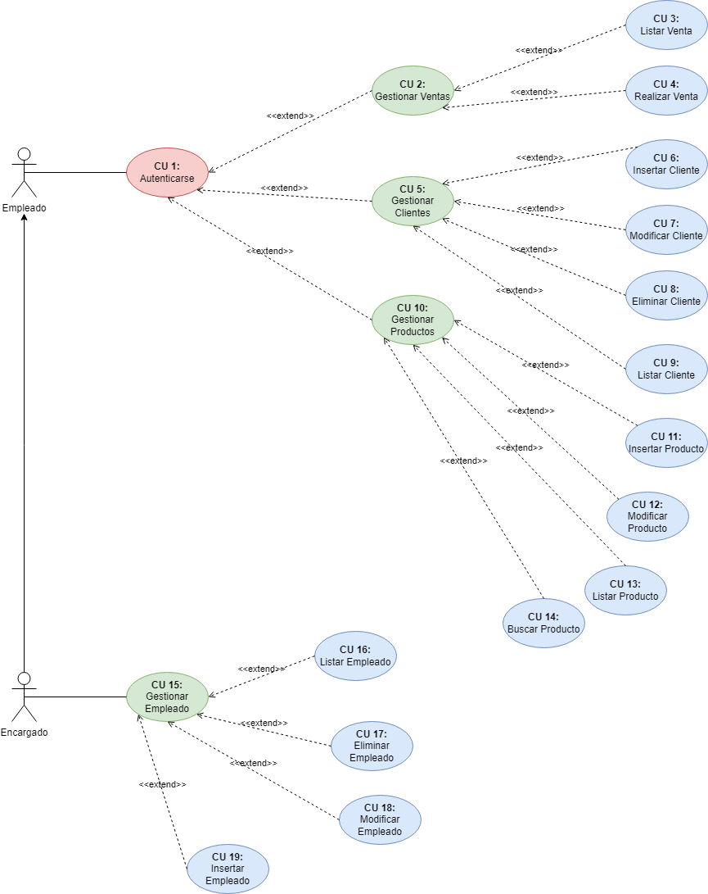

# Gameda Games

## Índice
- [Introducción](#introducción).
- [Descripción](#descripción).
- [Diagrama de Casos de Uso](#diagrama-de-casos-de-uso).
- [Especificación de Actores](#especificación-de-actores).
- [Especificación de Casos de Uso](#especificación-de-casos-de-uso).

### Introducción

El presente documento especifica el __diagrama de casos de uso__ de la aplicación Gameda Games solicitada por varias empresas que se encargan de la venta de productos relacionados al mundo de los videojuegos. Este documento trata a grandes rasgos, el diagrama de casos de uso, los casos de uso identificados, así como los actores que intervienen en ellos.

### Descripción

El objetivo es realizar una aplicación con la que gestionar los productos que se venden en la tienda, la venta de los mismos y aquellas personas que trabajan para la empresa.

### Diagrama de Casos de Uso

### Especificación de Actores

En el presente documento se realiza la especificación de los diferentes actores que intervienen en la solución propuesta.

#### Empleado

| Actor | Empleado |
|---|---|
| Descripción  | El empleado podrá realizar las tareas comunes de un sistema de estas características, gestionar ventas, gestionar productos, etc.  |
| Características  | Comparte casos de uso con el actor "Encargado" |
| Relaciones | - |
| Referencias | Autenticarse, Gestionar Venta, Listar Venta, Realizar Venta, Gestionar Cliente, Insertar Cliente, Modificar Cliente, Eliminar Cliente, Listar Cliente, Gestionar Producto, Insertar Producto, Modificar Producto, Eliminar Producto, Listar Producto.  |   
|  Notas | - |
| Autor  | _Abián Gustavo Castañeda Méndez y Diego Peraza Cabo_ |
|Fecha | _27/03/2023_ |

#### Encargado

| Actor | Encargado |
|---|---|
  | Descripción  | El encargado podrá realizar las mismas acciones que el empleado pero tendrá acceso a la supervisión de sus trabajadores mediante la "Gestionar Empleado". |
  | Características  | Comparte casos de uso con el actor "Empleado". |
  | Relaciones | El encargado puede hacer todas las acciones que realiza el actor "Empleado".  |
  | Referencias | Autenticarse, Gestionar Venta, Listar Venta, Realizar Venta, Gestionar Cliente, Insertar Cliente, Modificar Cliente, Eliminar Cliente, Listar Cliente, Gestionar Producto, Insertar Producto, Modificar Producto, Eliminar Producto, Listar Producto, Gestionar Empleado, Listar Empleado, Eliminar Empleado, Modificar Empleado, Insertar Empleado.  |   
  |  Notas | - |
  | Autor  | _Abián Gustavo Castañeda Méndez y Diego Peraza Cabo_ |
  |Fecha | _27/03/2023_ |

### Especificación de Casos de Uso

#### Autenticarse

|  Caso de Uso	CU.1 | Autenticarse |
|---|---|
| Fuentes  | El caso de uso se sustenta en [este documento](https://github.com/AbianGustavo/proyecto-ets/blob/feature_10/doc/diagrama-casos-uso.md).|
| Actor  | Empleado, Encargado |
| Descripción | Tanto el empleado como el encargado deben autenticarse antes de poder realizar alguna de las acciones. |
| Flujo básico | - |
| Pre-condiciones | - |  
| Post-condiciones  | - |  
|  Requerimientos | - |
|  Notas | - |
| Autor  | _Abián Gustavo Castañeda Méndez y Diego Peraza Cabo_ |
|Fecha | _27/03/2023_ |

#### Gestionar Venta

|  Caso de Uso	CU.2 | Gestionar Venta |
|---|---|
| Fuentes  | El caso de uso se sustenta en [este documento](https://github.com/AbianGustavo/proyecto-ets/blob/feature_10/doc/diagrama-casos-uso.md).|
| Actor  | Empleado, Encargado |
| Descripción | Tanto el empleado como el encargado podrán gestionar todo lo relacionado a las ventas. |
| Flujo básico | Autenticarse --> Gestionar Venta |
| Pre-condiciones | - |  
| Post-condiciones  | - |  
|  Requerimientos | Haberse autenticado. |
|  Notas | - |
| Autor  | _Abián Gustavo Castañeda Méndez y Diego Peraza Cabo_ |
|Fecha | _27/03/2023_ |

#### Listar Venta

|  Caso de Uso	CU.3 | Listar Venta |
|---|---|
| Fuentes  | El caso de uso se sustenta en [este documento](https://github.com/AbianGustavo/proyecto-ets/blob/feature_10/doc/diagrama-casos-uso.md).|
| Actor  | Empleado, Encargado |
| Descripción | Tanto el empleado como el encargado podrán listar y comprobar las ventas que se hayan realizado. |
| Flujo básico | Autenticarse --> Gestionar Venta --> Listar Venta |
| Pre-condiciones | - |  
| Post-condiciones  | - |  
|  Requerimientos | Haber seleccionado "Gestionar Venta" y autenticarse. |
|  Notas | - |
| Autor  | _Abián Gustavo Castañeda Méndez y Diego Peraza Cabo_ |
|Fecha | _27/03/2023_ |

#### Realizar Venta

|  Caso de Uso	CU.4 | Realizar Venta |
|---|---|
| Fuentes  | El caso de uso se sustenta en [este documento](https://github.com/AbianGustavo/proyecto-ets/blob/feature_10/doc/diagrama-casos-uso.md).|
| Actor  | Empleado, Encargado |
| Descripción | Tanto el empleado como el encargado podrán realizar ventas. |
| Flujo básico | Autenticarse --> Gestionar Venta --> Realizar Venta |
| Pre-condiciones | - |  
| Post-condiciones  | - |  
|  Requerimientos | Haber seleccionado "Gestionar Venta" y autenticarse. |
|  Notas | - |
| Autor  | _Abián Gustavo Castañeda Méndez y Diego Peraza Cabo_ |
|Fecha | _27/03/2023_ |

#### Gestionar Cliente

|  Caso de Uso	CU.5 | Gestionar Cliente |
|---|---|
| Fuentes  | El caso de uso se sustenta en [este documento](https://github.com/AbianGustavo/proyecto-ets/blob/feature_10/doc/diagrama-casos-uso.md).|
| Actor  | Empleado, Encargado |
| Descripción | Tanto el empleado como el encargado podrán gestionar todo lo realizado a sus clientes. |
| Flujo básico | Autenticarse --> Gestionar Cliente |
| Pre-condiciones | - |  
| Post-condiciones  | - |  
|  Requerimientos | Haberse autenticado. |
|  Notas | - |
| Autor  | _Abián Gustavo Castañeda Méndez y Diego Peraza Cabo_ |
|Fecha | _27/03/2023_ |

#### Insertar Cliente

|  Caso de Uso	CU.6 | Insertar Cliente |
|---|---|
| Fuentes  | El caso de uso se sustenta en [este documento](https://github.com/AbianGustavo/proyecto-ets/blob/feature_10/doc/diagrama-casos-uso.md).|
| Actor  | Empleado, Encargado |
| Descripción | Tanto el empleado como el encargado podrán insertar en el sistema nuevos clientes y sus datos. |
| Flujo básico | Autenticarse --> Gestionar Cliente --> Insertar Cliente |
| Pre-condiciones | - |  
| Post-condiciones  | - |  
|  Requerimientos | Haber seleccionado "Gestionar Cliente" y autenticarse. |
|  Notas | - |
| Autor  | _Abián Gustavo Castañeda Méndez y Diego Peraza Cabo_ |
|Fecha | _27/03/2023_ |

